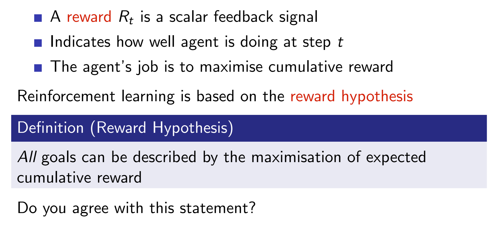
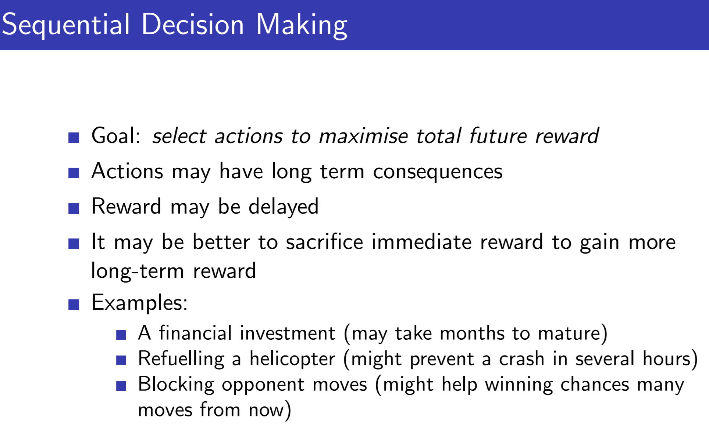
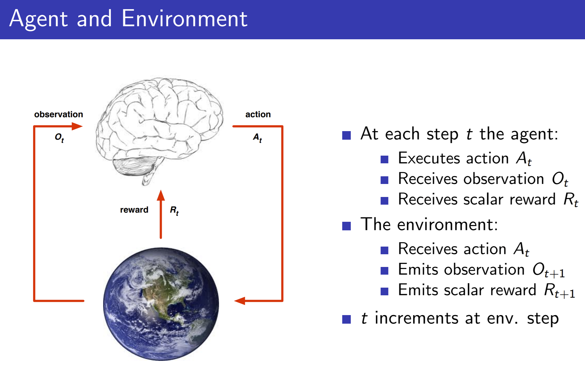
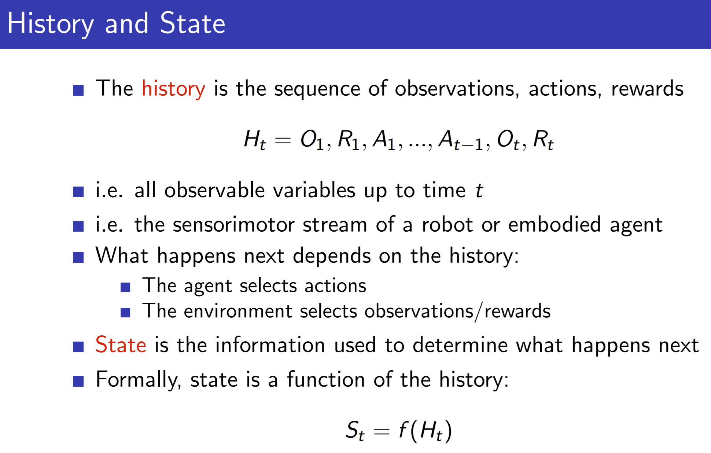
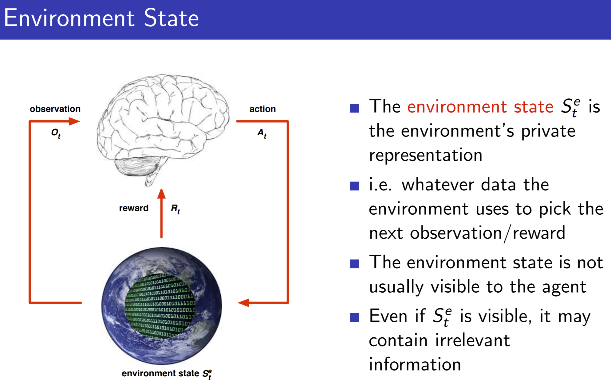

# Module 01: The K-Armed Bandit Problem

## Resources:
- [David Silver's RL Course](https://deepmind.com/learning-resources/-introduction-reinforcement-learning-david-silver)
    - scroll down to Lecture 1
- Reading: Chapter 2-2.7 (Pages 25-36)

## Outline
- Lesson 1: The K-Armed Bandit Problem
    - Define reward
    - Understand the temporal nature of the bandit problem
    - Define k-armed bandit
    - Define action-values
 
 From David Silver's Course:
    
 
 
 - the goal is to develop a unifying framework within the amchine learning field 
 where by using the same RL formalism of (agents, rewards) we can spolve 
 a wide variety of problems
 - the unifying framework is sequential decision making and the same goal makes
 it unifying:
 
 
 
 - the formalism that we are going to use:
    - brain -> agent -> algorithm (our goal is to figure 
    these algorithms)
    - every time step there is a cycle of agent-environment interaction
    - the agent influences the environment only through actions
    - the trial & error loop we define in the algorithm a time series (observation-rewards-actions)
    - this time series defines the experience of the agent
    - the experience of the agent is the data that we use for RL  (the machine learning 
    problem of RL concerns of this source / stream of data coming through)
 
  
  
  - so the experience we call it the history
    - the algorithm -> mapping of history  with actions
    - replace the history with some concise summary that captures all the info 
    that we need in order to determine what happens next we have a much better chance
    to solve real world problems
  
  
    
 - there are 3 definitions of State
 
 - the Environment State
    - doesn't tell us any useful since we/the agent don't see that
     
 
 
 - the Agent State
 
  
  
 - the Information/Markov State
    
    

    
- Lesson 2: What to Learn? Estimating Action Values
    - Define action-value estimation methods
    - Define exploration and exploitation
    - Select actions greedily using an action-value function
    - Define online learning
    - Understand a simple online sample-average action-value estimation method
    - Define the general online update equation
    - Understand why we might use a constant stepsize in the case of non-stationarity

- Lesson 3: Exploration vs. Exploitation Tradeoff
    - Define epsilon-greedy
    - Compare the short-term benefits of exploitation and the long-term benefits of exploration
    - Understand optimistic initial values
    - Describe the benefits of optimistic initial values for early exploration
    - Explain the criticisms of optimistic initial values
    - Describe the upper confidence bound action selection method
    - Define optimism in the face of uncertainty
 

 
 