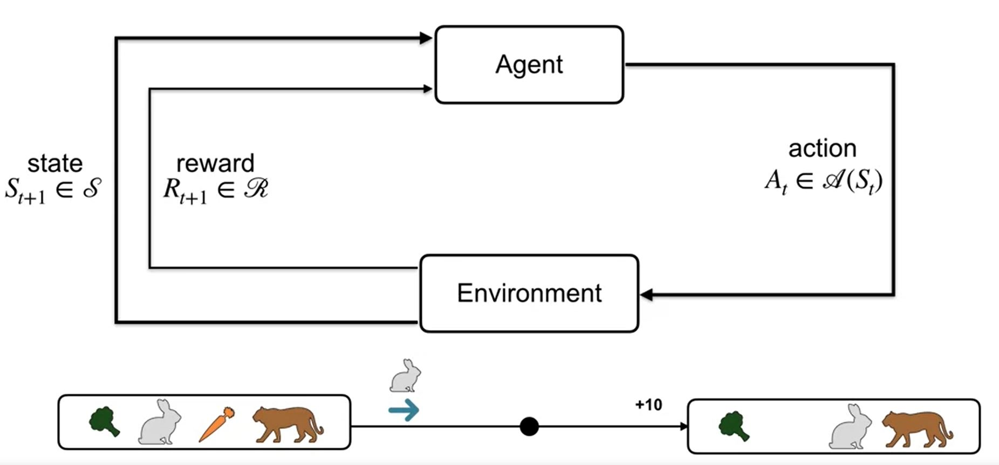
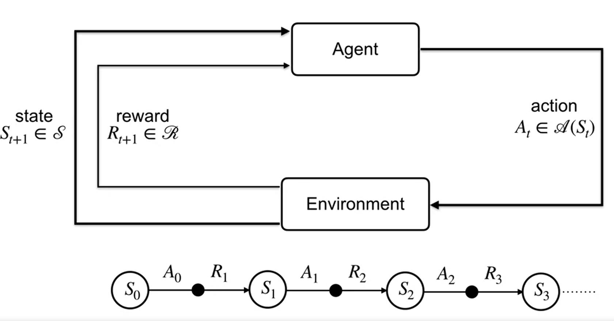
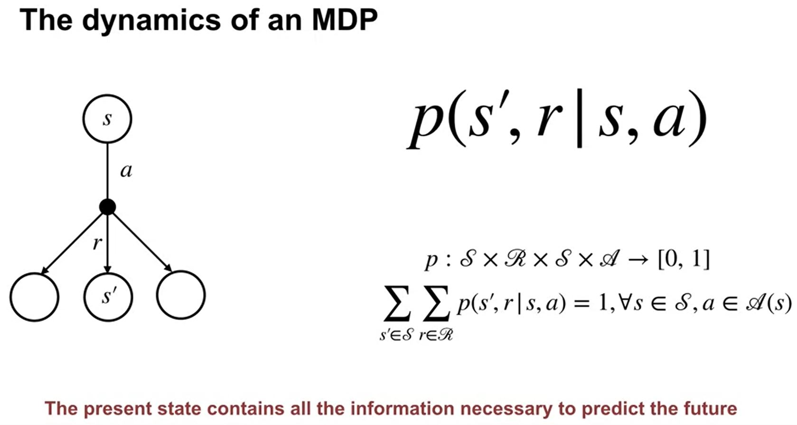
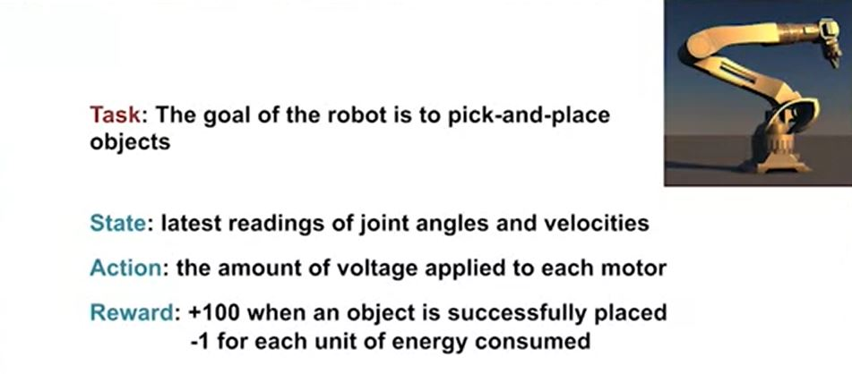

# Module 02: Markov Decision Processes

## Resources:
- [Coursers - RL](https://www.coursera.org/learn/fundamentals-of-reinforcement-learning/home/week/2)
- [David Silver's RL Course](https://deepmind.com/learning-resources/-introduction-reinforcement-learning-david-silver)
    - scroll down to Lecture 1
- Reading: Chapter 3.3 (pages 47-56) 

## Lessons - Notes  
### Lesson 1: Markov Decision Processes

- the k-armed bandit problem doesn't account for the fact that different situations call 
for different actions
- account for the long-term impact for our actions
- bandits care only for immediate reward  

- the diagram below summarizes the agent environment interaction in the MDP framework

  
- the agent environment generates a <b>trajectory of experience</b> consisting
of:
  - <i>states</i>
  - <i>actions</i>
  - <i>rewards</i>
  
- actions influence immediate rewards, as well as future states and through these
future rewards

  
- When the agent takes an action in a state, there are many possible next 
  states and rewards. The transition dynamics function P, formalizes this 
  notion. Given a state S and action a, p tells us the joint probability of 
  next state S prime and reward are. In this course, we will typically
  assume that the set of states, actions, and rewards are finite. 
  But don't worry, you will learn about algorithms that can handle infinite 
  sets and uncountable sets. Since p is a probability distribution, it must 
  be non-negative and it's sum over all possible next states and rewards 
  must equal one. Note that future state and reward only depends on the 
  current state and action. This is called the Markov property. It means 
  that the present state is sufficient and remembering earlier states would 
  not improve predictions about the future. That's it for this video. In 
  summary, MDPs provide a general framework for sequential decision making 
  and the dynamics of an MDP are defined by a probability distribution.

  
- The MDP formalism can be used to formalize a wide variety of sequential decision-making 
problems:

### Lesson 2: Goal of Reinforcement Learning

 
 